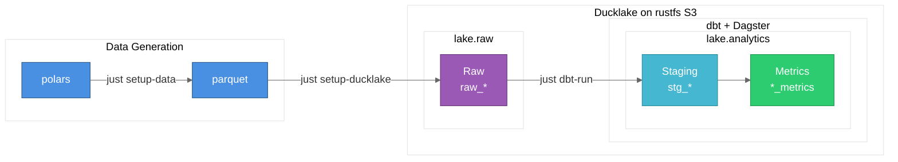

# Data Testbed Project

A demonstration project for learning the interactions between DuckLake, dbt, and Dagster. Disclaimer: 90% vibe-coded.

## Requirements
* uv
* duckdb >= 1.2
* just
* rustfs

```bash
brew tap rustfs/homebrew-tap
brew install uv duckdb just rustfs
```

## Quick Start

```bash
# Run once to create a required .env file
just setup-env

# Install dependencies, generate data and set up warehouse
just setup

# Inspect all your data and assets
just inspect

# Run dbt transformations
just dbt-run

# Start Dagster UI
just serve

# Nuke envs, data, logs, state, rebuild and inspect all
just rebuild

```

Or just spam this

```bash
brew tap rustfs/homebrew-tap
brew install uv duckdb just rustfs
gh repo clone adammarples/testbed
cd testbed
just setup-env
just setup
just inspect
```

## Architecture



## Components

### data_generator
Generates synthetic retail data (customers, stores, products, sales) as parquet files in data/generated_data.

### data/

* host.duckdb: A Duckdb database acting as an entrypoint for the lakehouse
* lakehouse.ducklake: The Lakehouse. Holds the catalogue tables in the '__ducklake_metadata_metadata' database. Holds the data tables in the 'lake' database.
* generated_data: The inital sample data in parquet files
* rustfs/ducklake-data: The actual db parquet data being served via rustfs on s3://ducklake-data/

- `raw_customers` - customer dimension with SCD2 history
- `raw_stores` - store dimension with SCD2 history
- `raw_products` - product catalog
- `raw_sales` - sales transactions

### orchestrator/dbt_project
dbt project that transforms source data into:
- **Staging layer**: Clean views of raw tables
- **Metrics layer**: Aggregated business metrics (customer lifetime value, store performance, product analytics)

### orchestrator/dagster_project
Dagster code that sets up dbt assets.
