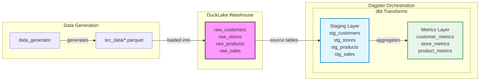

# Data Testbed Project

A demonstration project for learning the interactions between DuckLake, dbt, and Dagster. Disclaimer: 90% vibe-coded.

## Requirements
* uv
* duckdb >= 1.2
* just

```bash
brew install uv duckdb just
```

## Quick Start

```bash
# Run once to create a required .env file
just setup-env

# Install dependencies, generate data and set up warehouse
just setup

# Inspect all your data and assets
just inspect

# Run dbt transformations
just dbt-run

# Start Dagster UI
just dagster-dev

# Nuke envs, data, logs, state, rebuild and inspect all
just rebuild

```

## Architecture



## Components

### data_generator
Generates synthetic retail data (customers, stores, products, sales) as parquet files.

### src_db
DuckLake warehouse storing source data with:
- `raw_customers` - customer dimension with SCD2 history
- `raw_stores` - store dimension with SCD2 history
- `raw_products` - product catalog
- `raw_sales` - sales transactions

### orchestrator/dbt_project
dbt project that transforms source data into:
- **Staging layer**: Clean views of raw tables
- **Metrics layer**: Aggregated business metrics (customer lifetime value, store performance, product analytics)

### orchestrator/dagster_project
Dagster code that orchestrates the dbt transformations.


## Tech Stack

- **DuckDB** - embedded analytical database
- **DuckLake** - lakehouse format built on DuckDB
- **dbt** - data transformation framework
- **Dagster** - data orchestration platform
- **uv** - Python package manager
- **just** - command runner
