# Data Testbed Project

A demonstration project for learning the interactions between DuckLake, dbt, and Dagster. Disclaimer: 90% vibe-coded.

## Requirements
* uv
* duckdb >= 1.2
* just
* minio
* tree

```bash
brew install uv duckdb just minio/stable/minio tree
```

## Quick Start

```bash
# Run once to create a required .env file
just setup-env

# Install dependencies, generate data and set up warehouse
just setup

# Inspect all your data and assets
just inspect

# Run dbt transformations
just dbt-run

# Start Dagster UI
just serve

# Nuke envs, data, logs, state, rebuild and inspect all
just rebuild

```

## Architecture

```mermaid
%%{init: {'theme':'base', 'themeVariables': {'primaryColor':'#f0f0f0','primaryTextColor':'#333','primaryBorderColor':'#666','lineColor':'#666','secondaryColor':'#fff','tertiaryColor':'#fff'}}}%%
flowchart LR
    subgraph gen["📦 Data Generation"]
        A[Python Generator]
        B[Parquet Files]
        A --> B
    end

    subgraph lake["Duckdb - ducklake / minio"]
        subgraph raw["Raw Schema"]
            C[raw_customers<br/>raw_stores<br/>raw_products<br/>raw_sales]
        end

        subgraph orch["🔄 dbt + Dagster"]
            subgraph analytics["Analytics Schema"]
                D[Staging<br/>stg_*]
                E[Metrics<br/>*_metrics]
            end
        end
    end

    B --> C
    C --> D
    D --> E

    style A fill:#4a90e2,stroke:#2e5c8a,color:#fff
    style B fill:#4a90e2,stroke:#2e5c8a,color:#fff
    style C fill:#9b59b6,stroke:#6c3a7c,color:#fff
    style D fill:#45b7d1,stroke:#2a8ca0,color:#fff
    style E fill:#2ecc71,stroke:#229954,color:#fff
```



## Components

### data_generator
Generates synthetic retail data (customers, stores, products, sales) as parquet files in data/generated_data.

### data/

* lakehost.duckdb: A DuckLake warehouse acting as an entrypoint for the datalake
* catalogue.ducklake: The catalogue tables. When attached to lakehost which has ducklake installed, it appears to hold the data tables instead.
* generated_data: The inital sample data in parquet files
* minio/ducklake-data/data: The actual data being served via minio on s3://ducklake-data/data/

- `raw_customers` - customer dimension with SCD2 history
- `raw_stores` - store dimension with SCD2 history
- `raw_products` - product catalog
- `raw_sales` - sales transactions

### orchestrator/dbt_project
dbt project that transforms source data into:
- **Staging layer**: Clean views of raw tables
- **Metrics layer**: Aggregated business metrics (customer lifetime value, store performance, product analytics)

### orchestrator/dagster_project
Dagster code that orchestrates the dbt transformations.
